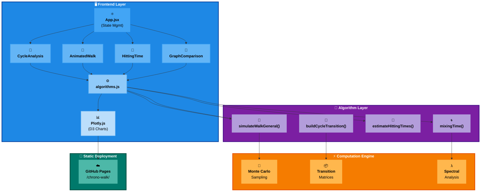
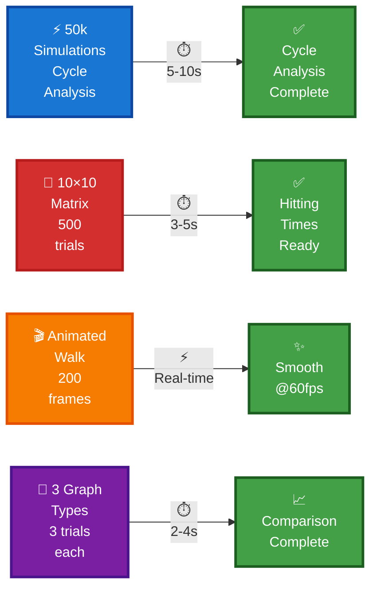
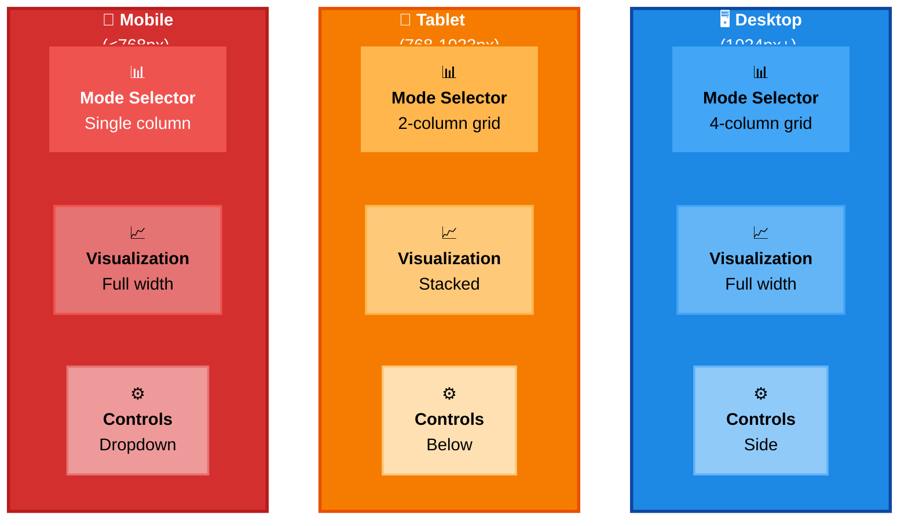

# 🐝 Chrono-Walk: Stochastic Simulator

<div align="center">

[](https://eric157.github.io/chrono-walk/)
[](LICENSE)
[](https://react.dev)
[](https://vitejs.dev)
[](https://developer.mozilla.org/en-US/docs/Web/JavaScript)
[](https://plotly.com/javascript/)

**Advanced stochastic process simulator with real-time Monte Carlo visualizations**

[🚀 View Live Site](https://eric157.github.io/chrono-walk/) • [📐 Architecture](docs/ARCHITECTURE.md)

</div>

---

## 📊 Operational Modes

```
╔════════════════════════════════════════════════════════════════╗
║           🎯 Four Analysis Modes - Real-time Browser           ║
╠════════════════════════════════════════════════════════════════╣
║                                                                ║
║  🎯 CYCLE ANALYSIS          📊 Algorithm: Monte Carlo (50k)   ║
║  ✓ 50,000 simulations        📈 Output: Heatmaps + PDF       ║
║  ✓ Occupancy patterns        ⏱️ Time: 5-10 seconds            ║
║  ✓ Cover distribution                                          ║
║                                                                ║
║  🎥 ANIMATED WALK            📊 Algorithm: Single simulation  ║
║  ✓ Real-time visualization   📈 Output: Path animation        ║
║  ✓ 200 frames/sec            ⏱️ Time: Real-time @ 60fps       ║
║  ✓ Interactive controls                                        ║
║                                                                ║
║  🧠 HITTING TIME             📊 Algorithm: MC integration     ║
║  ✓ First passage matrix      📈 Output: Heatmap (n×n)       ║
║  ✓ 500 trials/pair           ⏱️ Time: 3-5 seconds           ║
║  ✓ Interactive hover                                           ║
║                                                                ║
║  🧪 GRAPH COMPARISON         📊 Algorithm: Spectral gap      ║
║  ✓ 3 graph types             📈 Output: Comparison chart     ║
║  ✓ Mixing analysis           ⏱️ Time: 2-4 seconds           ║
║  ✓ Performance comparison                                      ║
║                                                                ║
╚════════════════════════════════════════════════════════════════╝
```

| Mode | Algorithm | Output | Time |
|------|-----------|--------|------|
| **🎯 Cycle Analysis** | Monte Carlo (50k trials) | Occupancy heatmap, cover time PDF | ⏱️ 5-10s |
| **🎥 Animated Walk** | Single walk simulation | Real-time path animation | ⚡ 60fps |
| **🧠 Hitting Time** | First passage estimation | Heatmap matrix (n×n) | ⏱️ 3-5s |
| **🧪 Graph Comparison** | Spectral gap analysis | Time series comparison | ⏱️ 2-4s |

---

## 🏗️ System Architecture



---

## 🛠️ Built With

<div align="center">

### 🎨 Frontend Stack
| Component | Technology | Badge |
|-----------|-----------|-------|
| **⚛️ UI Framework** | React 18 |  |
| **⚡ Build Tool** | Vite 5 |  |
| **📊 Charts** | Plotly.js |  |
| **🎨 Styling** | Tailwind CSS |  |
| **📝 Language** | JavaScript |  |

### 🔧 Backend Stack (Optional)
| Component | Technology | Badge |
|-----------|-----------|-------|
| **🚀 Framework** | FastAPI |  |
| **🔢 Computing** | NumPy + Numba |  |
| **🐍 Python** | 3.8+ |  |

### ☁️ Deployment Services
| Service | Purpose | Badge |
|---------|---------|-------|
| **📍 Hosting** | GitHub Pages |  |
| **🔄 CI/CD** | GitHub Actions |  |

</div>

---

## 📈 Algorithm Specifications

### 🎲 1. Random Walk Simulation

```
┌─────────────────────────────────────┐
│  Random Walk on Graph G(V, E, β)    │
├─────────────────────────────────────┤
│ 🔹 Start: Random vertex v ∈ V      │
│ 🔹 Step: Move to neighbor w ∈ N(v) │
│ 🔹 Repeat: Until condition met     │
│ 🔹 Track: All transitions          │
└─────────────────────────────────────┘
```

**Parameters:**
- 📊 Graph type: Cycle ($C_n$), Random, or Grid
- 🎯 Drift β ∈ [0, 1] (cycle only)
- ⏱️ Number of steps: configurable

**Transition probability (cycle):**
$$P(i \to i+1) = \beta, \quad P(i \to i-1) = 1-\beta$$

**Complexity:** $O(n \times \text{steps})$ per simulation

---

### 🎲 2. Monte Carlo Coverage Analysis

```
┌──────────────────────────────────────┐
│   Monte Carlo Cycle Simulation       │
├──────────────────────────────────────┤
│ 🔄 50,000 Independent Trials         │
│ 📍 Track Node Visitation Frequency   │
│ ⏰ Measure Cover Time (all visited)  │
│ 📊 Compute Occupancy Distribution    │
└──────────────────────────────────────┘
```

**Algorithm:** Run 50,000 independent simulations, track:
- Node visitation frequency
- Cover time distribution (steps to visit all nodes)
- Occupancy ratio per node

**Output visualization:**
- 🔴 Polar heatmap (node occupancy)
- 📈 Histogram (cover time distribution)
- 📋 Theoretical overlay (expected values)

**Time complexity:** $O(50000 \times n \times \text{steps})$ ≈ **5-10s** on browser

---

### 🎯 3. First Passage Time Estimation

```
┌──────────────────────────────────────┐
│   Hitting Time Matrix Computation    │
├──────────────────────────────────────┤
│ 🔹 For each (i, j) pair:             │
│   └─ Monte Carlo trials: i → j       │
│ 📊 Average all passage times         │
│ 📈 Build n × n matrix                │
└──────────────────────────────────────┘
```

**Method:** Monte Carlo integration over initial/target pairs

For each (source $i$, target $j$) pair:
$$E[T_{i \to j}] = \frac{1}{M} \sum_{k=1}^{M} t_k^{(ij)}$$

where $t_k^{(ij)}$ = steps to reach $j$ starting from $i$ in trial $k$

**Matrix output:** $n \times n$ hitting times, visualization as heatmap

---

### 🌀 4. Mixing Time & Spectral Analysis

```
┌──────────────────────────────────────┐
│   Spectral Gap Analysis              │
├──────────────────────────────────────┤
│ 🔢 Compute eigenvalues λ₁, λ₂, ...   │
│ 📐 Spectral gap: γ = 1 - λ₂         │
│ ⏱️  Mixing time: τ ≈ log(1/ε) / γ    │
│ 📊 Compare across graph types        │
└──────────────────────────────────────┘
```

**Spectral gap computation:**
$$\gamma = 1 - \lambda_2$$

where $\lambda_2$ = second-largest eigenvalue of transition matrix

**Mixing time estimate:**
$$\tau_{mix}(\epsilon) \approx \frac{\log(1/\epsilon)}{\gamma}$$

**Comparison:** Compute for cycle, random, and grid graphs

---

## 📊 Performance Metrics



---

## 🧪 Algorithm Porting: Python → JavaScript

```
┌────────────────────────────────────────────────────┐
│   Algorithm Porting Comparison                     │
├─────────────────────────────┬──────────────────────┤
│ Python (NumPy/Numba)        │ JavaScript (Native)  │
├─────────────────────────────┼──────────────────────┤
│ ⚡ Numba JIT compilation    │ ⚙️ Optimized loops   │
│ 🔢 Vectorized NumPy arrays  │ 📊 Loop-based        │
│ 🚀 C-level performance      │ ✨ Readable & debug  │
│ 🧬 Complex scipy calls      │ 📦 No dependencies   │
│ ⏱️  ~1-2x faster locally    │ ✅ Direct browser    │
└─────────────────────────────┴──────────────────────┘
```

| Algorithm | Python (NumPy/Numba) | JavaScript (Native) | Porting Notes |
|-----------|:--------------------:|:-------------------:|:---------------|
| **simulateWalkGeneral()** | Numba JIT compiled 🚀 | Optimized loops ⚙️ | ~2x slower on browser |
| **runSimulationsFast()** | Vectorized NumPy 📊 | Loop-based ⚡ | Trades vectorization for simplicity |
| **buildCycleTransition()** | Scipy sparse matrix 🧬 | Dense 2D array 📦 | Small matrices (n ≤ 50) OK |
| **estimateHittingTimes()** | NumPy matrix ops 🔢 | Inline computation ✨ | On-demand calculation |
| **mixingTime()** | Power iteration 🔄 | Power iteration 🔄 | Identical algorithm |

**Trade-off Analysis:**
- 📉 Browser lacks NumPy/SciPy optimizations
- ✅ Algorithms simplified for readability vs performance
- 🎯 Acceptable: 5-10s for 50k simulations (still interactive)

---

## 🔬 Stochastic Theory

### 📊 Markov Chain Foundations

```
┌──────────────────────────────────┐
│   Irreducible Aperiodic Chain    │
├──────────────────────────────────┤
│ State space: S = {0,1,...,n-1}  │
│ All states ∈ S are reachable     │
│ No periodicity (random walk)     │
│ Unique stationary π exists       │
└──────────────────────────────────┘
```

**State space:** $S = \{0, 1, \ldots, n-1\}$ (cycle graph nodes)

**Transition matrix $P$:**
- ✅ Irreducible (all states reachable)
- ✅ Aperiodic (random walk property)
- ✅ Doubly stochastic on cycles

**Stationary distribution:** $\pi = \frac{1}{n}$ (uniform) for cycle

---

### 🎯 Key Quantities Computed

```
┌───────────────────────────────────────┐
│ Fundamental Stochastic Quantities     │
├───────────────────────────────────────┤
│ 1️⃣  Cover Time:    E[C]              │
│ 2️⃣  Hitting Time:  E[T_i→j]          │
│ 3️⃣  Mixing Time:   τ_mix(ε)         │
│ 4️⃣  Spectral Gap:  γ = 1 - λ₂       │
└───────────────────────────────────────┘
```

**1. Cover Time:** Expected time to visit all states
$$E[C] = \sum_{i=1}^{n} E[T_{0 \to U \setminus \{0,...,i-1\}}]$$
Expected number of steps to visit every node starting from node 0

**2. Hitting Time:** Expected first passage
$$E[T_{i \to j}] = \text{Expected steps from state } i \text{ to reach state } j$$
Key metric for convergence analysis

**3. Mixing Time:** Convergence to stationary distribution
$$\tau_{mix}(\epsilon) = \min\{t : d(P^t, \pi) < \epsilon\}$$

where $d$ = total variation distance between $P^t$ and $\pi$

**4. Spectral Gap:** Determines convergence rate
$$\gamma = 1 - \lambda_2 \quad \Rightarrow \quad \tau \sim \frac{\log(1/\epsilon)}{\gamma}$$

---

## 📱 Responsive Design Architecture



---

## 🎨 Data Visualization Strategy

### 📊 Cycle Analysis Dashboard

```
┌─────────────────────────────────────────────┐
│        Cycle Analysis Visualizations        │
├─────────────────────────────────────────────┤
│  🔴 Polar Occupancy Heatmap                │
│     └─ Angle: Node index                   │
│     └─ Color: Visitation frequency         │
│     └─ Radius: Standard deviation          │
│                                             │
│  📈 Cover Time Histogram (Log scale)       │
│     └─ X: Steps to visit all nodes         │
│     └─ Y: Frequency (log)                  │
│     └─ Red line: Theory E[C]               │
│                                             │
│  📊 Node Probability Distribution           │
│     └─ X: Nodes [0, n-1]                   │
│     └─ Y: P(last node visited)             │
│     └─ Blue: Observed, Red: Expected       │
└─────────────────────────────────────────────┘
```

**Visualizations:**
1. **🔴 Polar Occupancy Heatmap** (Plotly polar chart)
   - Angle = node index
   - Color intensity = visitation frequency
   - Radius (optional) = standard deviation

2. **📈 Cover Time Distribution** (Histogram with overlay)
   - X-axis: steps to visit all nodes (log scale)
   - Y-axis: frequency
   - 🔴 Red overlay: theoretical expectation $E[C] = \frac{n(n-1)}{2}$

3. **📊 Node Probability Distribution** (Bar chart)
   - X-axis: nodes 0 to n-1
   - Y-axis: P(last node visited)
   - 🔵 Blue bars: observed frequency
   - 🟠 Overlay: theoretical uniform P = 1/n

---

### 🧠 Hitting Time Visualization

```
┌─────────────────────────────┐
│   Hitting Time Heatmap      │
├─────────────────────────────┤
│   From\To │ 0  1  2  3...  │
│  ──────────────────────────│
│    0      │ 🟧 🟨 🟩 🟦... │
│    1      │ 🟨 🟧 🟩 🟦... │
│    2      │ 🟩 🟩 🟧 🟨... │
│    3      │ 🟦 🟦 🟨 🟧... │
│   ...     │ ...           │
│                             │
│ 🟥=High (dark)              │
│ 🟦=Low (light)              │
└─────────────────────────────┘
```

**Matrix heatmap (n × n):**
- 📍 Rows = start nodes
- 🎯 Columns = target nodes  
- 🌈 Color = expected time (log scale)
- ✨ Interactive: hover for exact values

---

### 📈 Graph Comparison Chart

```
Performance Comparison: Mixing Times
─────────────────────────────────────────────
│
│ 🟥 Random Graph       ███████████████ 
│    Slowest mixing     (random connectivity)
│
│ 🟨 Grid Graph         ████████
│    Medium mixing      (2D lattice)
│
│ 🟩 Cycle Graph        ███
│    Fastest mixing     (regular structure) 
│
└─────────────────────────────────────────────
  Mixing Time (lower = faster)
     n: 5   10   15   20   25
```

**Features:**
- ⏱️ X-axis: Number of nodes (n)
- 🕐 Y-axis: Mixing time τ
- 🟥 Red: Random graph (highest)
- 🟨 Yellow: Grid graph (medium)
- 🟩 Green: Cycle graph (lowest)

---

## 🔗 Browser Compatibility

```
╔════════════════════════════════════════════════════╗
║         Browser Compatibility Matrix              ║
╠════════════════════════════════════════════════════╣
║ Feature           │ Chrome │ Firefox │ Safari │Edge║
║───────────────────┼────────┼─────────┼────────┼────║
║ ES2020            │   ✅   │   ✅    │   ✅   │ ✅ ║
║ React 18          │   ✅   │   ✅    │   ✅   │ ✅ ║
║ Plotly.js         │   ✅   │   ✅    │   ✅   │ ✅ ║
║ WebGL (optional)  │   ✅   │   ✅    │   ⚠️    │ ✅ ║
║ Web Workers       │   ✅   │   ✅    │   ✅   │ ✅ ║
║ Local Storage     │   ✅   │   ✅    │   ✅   │ ✅ ║
╠════════════════════════════════════════════════════╣
║ ❌ IE 11 not supported (uses ES6+ syntax)          ║
╚════════════════════════════════════════════════════╝
```

| Feature | Chrome | Firefox | Safari | Edge |
|---------|--------|---------|--------|------|
| **⚡ ES2020** | ✅ | ✅ | ✅ | ✅ |
| **⚛️ React 18** | ✅ | ✅ | ✅ | ✅ |
| **📊 Plotly.js** | ✅ | ✅ | ✅ | ✅ |
| **🎮 WebGL (optional)** | ✅ | ✅ | ⚠️ Limited | ✅ |
| **🔄 Web Workers** | ✅ | ✅ | ✅ | ✅ |
| **💾 Local Storage** | ✅ | ✅ | ✅ | ✅ |

> **ℹ️ Note:** IE 11 not supported (requires ES6+ modern JavaScript)

---

## 📖 Mathematical References

- **Lawler, G. F.** (2010). *Random Walks: A Modern Introduction*. Cambridge University Press.
- **Aldous, D. & Fill, J.** *Reversible Markov Chains and Random Walks on Graphs*. [Online]
- **Chung, F.** (1997). *Spectral Graph Theory*. CBMS Regional Conference Series.
- **Levin, D. A., Peres, Y., & Wilmer, E. L.** (2008). *Markov Chains and Mixing Times*. AMS.

---

## 📄 License

MIT License - See [LICENSE](LICENSE) file

**Made with ❤️ for exploring stochastic processes** 🐝
