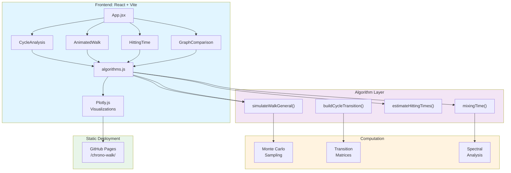
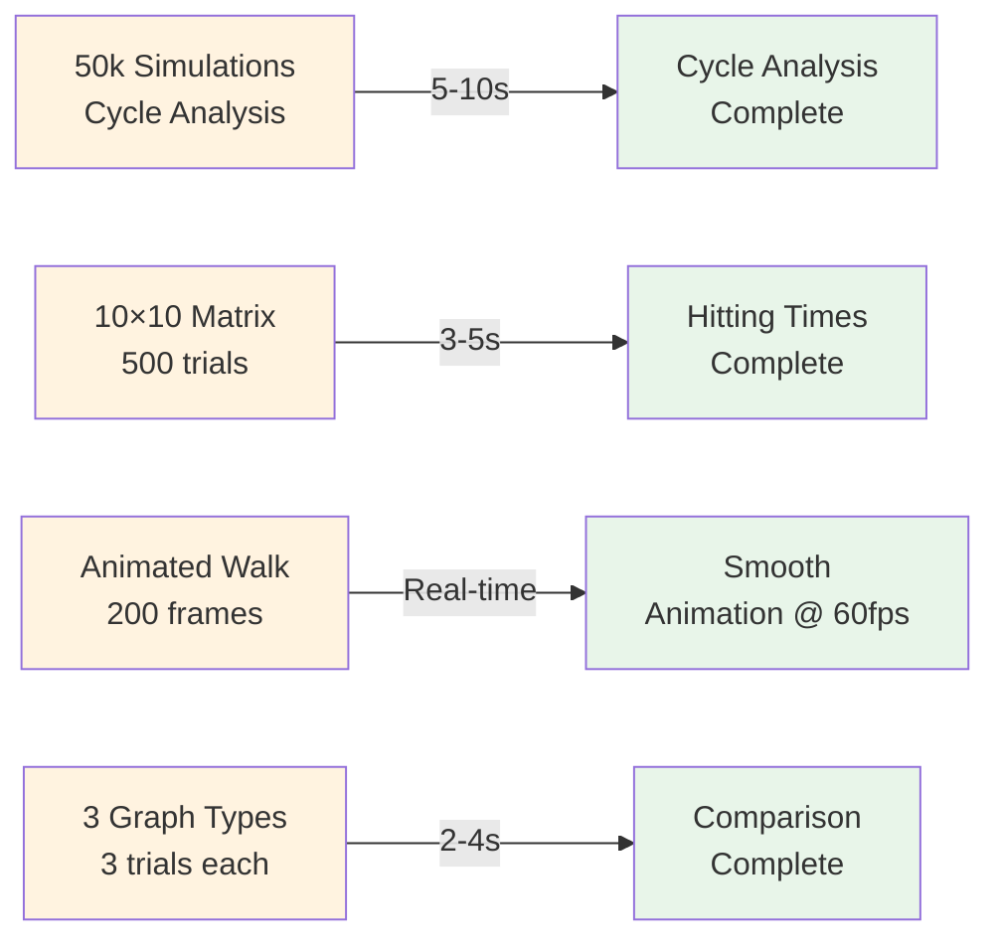
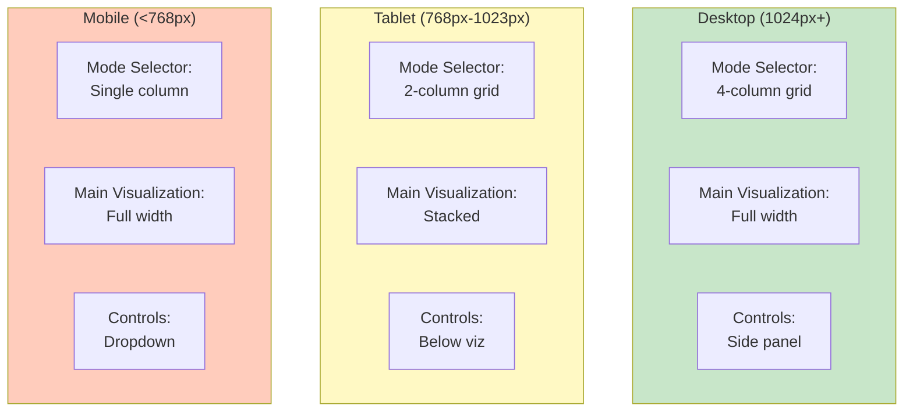

# 🐝 Chrono-Walk: Stochastic Simulator

<div align="center">

[](https://eric157.github.io/chrono-walk/)
[](LICENSE)
[](https://react.dev)
[](https://vitejs.dev)
[](https://developer.mozilla.org/en-US/docs/Web/JavaScript)
[](https://plotly.com/javascript/)

**Advanced stochastic process simulator with real-time Monte Carlo visualizations**

[🚀 View Live Site](https://eric157.github.io/chrono-walk/) • [📐 Architecture](docs/ARCHITECTURE.md) • [⚙️ Execution Details](docs/DEPLOY.md)

</div>

---

## 📊 Operational Modes

| Mode | Algorithm | Output | Computation |
|------|-----------|--------|-------------|
| **🎯 Cycle Analysis** | Monte Carlo (50k trials) | Occupancy heatmap, cover time PDF | 5-10s browser |
| **🎥 Animated Walk** | Single walk simulation | Real-time path animation | 200 fps |
| **🧠 Hitting Time** | First passage estimation | Heatmap matrix | 3-5s |
| **🧪 Graph Comparison** | Spectral gap analysis | Time series comparison | 2-4s |

---

## 🏗️ System Architecture



---

## 🛠️ Built With

<div align="center">

### Frontend Stack
| Component | Technology | Badge |
|-----------|-----------|-------|
| **UI Framework** | React 18 |  |
| **Build Tool** | Vite 5 |  |
| **Charts** | Plotly.js |  |
| **Styling** | Tailwind CSS |  |
| **Language** | JavaScript |  |

### Backend (Optional)
| Component | Technology | Badge |
|-----------|-----------|-------|
| **Framework** | FastAPI |  |
| **Computation** | NumPy + Numba |  |
| **Python** | 3.8+ |  |

### Deployment
| Service | Purpose | Badge |
|---------|---------|-------|
| **Hosting** | GitHub Pages |  |
| **CI/CD** | GitHub Actions |  |

</div>

---

## 📈 Algorithm Specifications

### 1. Random Walk Simulation

**Parameters:**
- Graph type: Cycle ($C_n$), Random, or Grid
- Drift β ∈ [0, 1] (cycle only)
- Number of steps: configurable

**Transition probability (cycle):**
$$P(i \to i+1) = \beta, \quad P(i \to i-1) = 1-\beta$$

**Complexity:** $O(n \times \text{steps})$ per simulation

---

### 2. Monte Carlo Coverage Analysis

**Algorithm:** Run 50,000 independent simulations, track:
- Node visitation frequency
- Cover time distribution (steps to visit all nodes)
- Occupancy ratio per node

**Output visualization:**
- Polar heatmap (node occupancy)
- Histogram (cover time distribution)
- Theoretical overlay (expected values)

**Time complexity:** $O(50000 \times n \times \text{steps})$ ≈ 5-10s on browser

---

### 3. First Passage Time Estimation

**Method:** Monte Carlo integration over initial/target pairs

For each (source $i$, target $j$) pair:
$$E[T_{i \to j}] = \frac{1}{M} \sum_{k=1}^{M} t_k^{(ij)}$$

where $t_k^{(ij)}$ = steps to reach $j$ starting from $i$ in trial $k$

**Matrix output:** $n \times n$ hitting times, visualization as heatmap

---

### 4. Mixing Time & Spectral Analysis

**Spectral gap computation:**
$$\gamma = 1 - \lambda_2$$

where $\lambda_2$ = second-largest eigenvalue of transition matrix

**Mixing time estimate:**
$$\tau_{mix}(\epsilon) \approx \frac{\log(1/\epsilon)}{\gamma}$$

**Comparison:** Compute for cycle, random, and grid graphs

---

## 📊 Performance Metrics



---

## 🧪 Algorithm Porting: Python → JavaScript

| Algorithm | Python (NumPy/Numba) | JavaScript (Native) | Porting Notes |
|-----------|----------------------|-------------------|---------------|
| `simulateWalkGeneral()` | Numba JIT compiled | Optimized loops | ~2x slower on browser |
| `runSimulationsFast()` | Vectorized NumPy | Loop-based | Trades vectorization for simplicity |
| `buildCycleTransition()` | Scipy sparse matrix | Dense 2D array | Small matrices (n ≤ 50) |
| `estimateHittingTimes()` | NumPy matrix ops | Inline computation | On-demand calculation |
| `mixingTime()` | Power iteration | Power iteration | Identical algorithm |

**Trade-off:** Browser lacks NumPy/SciPy, so algorithms simplified for readability vs. performance.

---

## 🔬 Stochastic Theory

### Markov Chain Foundations

**State space:** $S = \{0, 1, \ldots, n-1\}$ (cycle graph nodes)

**Transition matrix $P$:**
- Irreducible (all states reachable)
- Aperiodic (random walk property)
- Doubly stochastic on cycles

**Stationary distribution:** $\pi = \frac{1}{n}$ (uniform) for cycle

---

### Key Quantities Computed

**1. Cover Time:** Expected time to visit all states
$$E[C] = \sum_{i=1}^{n} E[T_{0 \to U \setminus \{0,...,i-1\}}]$$

**2. Hitting Time:** Expected first passage
$$E[T_{i \to j}] = \text{years until leaving state } i \text{ and reaching } j$$

**3. Mixing Time:** Convergence to stationary distribution
$$\tau_{mix}(\epsilon) = \min\{t : d(P^t, \pi) < \epsilon\}$$

where $d$ = total variation distance

---

## 📱 Responsive Design Architecture



---

## 🎨 Data Visualization Strategy

### Cycle Analysis Dashboard

1. **Polar Occupancy Heatmap** (Plotly polar chart)
   - Angle = node index
   - Color = visitation frequency
   - Radius (optional) = standard deviation

2. **Cover Time Distribution** (Histogram with overlay)
   - X-axis: steps to visit all nodes
   - Y-axis: frequency (log scale)
   - Overlay: theoretical expectation $E[C] = \frac{n(n-1)}{2}$

3. **Node Probability Distribution** (Bar chart)
   - X-axis: nodes 0 to n-1
   - Y-axis: P(last node visited)
   - Theoretical: uniform P = 1/n

---

### Hitting Time Visualization

**Matrix heatmap (n × n):**
- Rows = start nodes
- Columns = target nodes
- Color = expected time (log scale)
- Interactive: hover for exact values

---

### Graph Comparison Chart

**Time series overlay:**
```
Mixing Time vs. n
┌─────────────────────────────────────┐
│ Cycle (lowest)  ─────████           │
│ Grid (medium)  ──────█████████      │
│ Random (highest)  ──████████████    │
└─────────────────────────────────────┘
     n: 5   10   15   20   25
```

---

## 🔗 Browser Compatibility

| Feature | Chrome | Firefox | Safari | Edge |
|---------|--------|---------|--------|------|
| ES2020 | ✅ | ✅ | ✅ | ✅ |
| React 18 | ✅ | ✅ | ✅ | ✅ |
| Plotly.js | ✅ | ✅ | ✅ | ✅ |
| WebGL (optional) | ✅ | ✅ | ⚠️ | ✅ |
| Web Workers | ✅ | ✅ | ✅ | ✅ |

**Note:** IE 11 not supported (uses ES6+ syntax)

---

## 📖 Mathematical References

- **Lawler, G. F.** (2010). *Random Walks: A Modern Introduction*. Cambridge University Press.
- **Aldous, D. & Fill, J.** *Reversible Markov Chains and Random Walks on Graphs*. [Online]
- **Chung, F.** (1997). *Spectral Graph Theory*. CBMS Regional Conference Series.
- **Levin, D. A., Peres, Y., & Wilmer, E. L.** (2008). *Markov Chains and Mixing Times*. AMS.

---

## 📄 License

MIT License - See [LICENSE](LICENSE) file

**Made with ❤️ for exploring stochastic processes** 🐝
